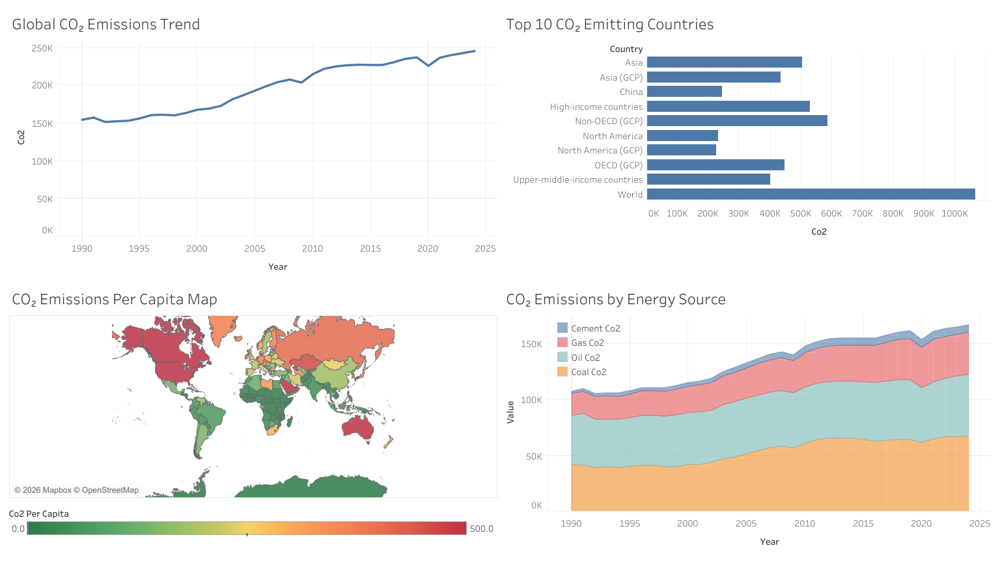

# 🌍 CO2 Emissions Analysis
---
## Project Overview
This project analyzes global CO2 emissions trends using historical data from Our World in Data.  
It demonstrates how data analytics can be applied to monitor environmental impact, identify high-emitting countries, and explore trends in CO2 emissions per capita and by energy source.  
The goal is to provide actionable insights for sustainability analysis and policy evaluation.

---
## Tools Used
Python  
SQL  
Tableau  
Excel

---
## Dataset
CO2 and Greenhouse Gas Emissions dataset from Our World in Data.  
Key columns:  
`country`, `year`, `population`, `gdp`, `co2`, `co2_per_capita`, `coal_co2`, `oil_co2`, `gas_co2`, `cement_co2`  
> **Note:** This dataset is publicly available and used for educational and analytical purposes.

---
## Key Analysis
- Global CO2 emissions trend
- Top 10 emitting countries
- CO2 emissions per capita
- Emissions by energy source

---
## Tableau Dashboard

---
## Key Insights
- Global CO₂ emissions have steadily increased since 1990, with rapid growth after 2000.
- A small number of large economies account for a significant share of global emissions.
- Developed countries tend to have higher CO₂ emissions per capita compared to developing regions.
- Coal remains the largest contributor to global CO₂ emissions, followed by oil and natural gas.
  
